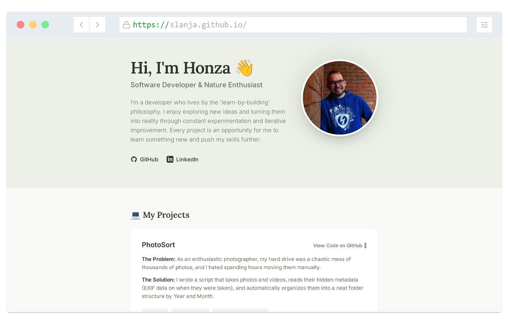

# 🌿 Jan Slaný | Personal Portfolio



> My personal slice of the internet, built with a focus on minimalism, nature, and the 'learn-by-building' philosophy.

[](https://slanja.github.io/)

## ✨ Features

* **Minimalist & Nature-Inspired Design:** Clean UI using a sage green and earthy color palette.
* **Fully Responsive:** Looks great on mobile, tablet, and desktop.
* **SEO Optimized:** Includes meta tags, Open Graph, Twitter cards, and JSON-LD structured data.
* **Custom 404 Page:** Features a bouncy otter 🦦 because getting lost shouldn't be boring.
* **Easter Egg Favicon:** A saltshaker 🧂 as a playful nod to my surname (*Slaný* = salty).

## 🛠️ Tech Stack

* **HTML5** (Semantic & Accessible)
* **Tailwind CSS** (via CDN for zero-build-step simplicity)
* **Google Fonts** (Inter & Lora)

## 🚀 Running Locally

Since this project intentionally avoids complex build tools to remain lightweight, running it locally is incredibly simple:

1. Clone the repository: 

```bash
git clone https://github.com/slanja/slanja.github.io.git
```

2. Open the directory and double-click index.html to open it in your favorite browser.

*(Tip: If you are using VS Code, use the "Live Server" extension for automatic reloading when you make changes).*


## 📬 Connect with me

[](https://www.linkedin.com/in/slany3jan/)
[](https://github.com/slanja)

---
*Coded with love ❤️*